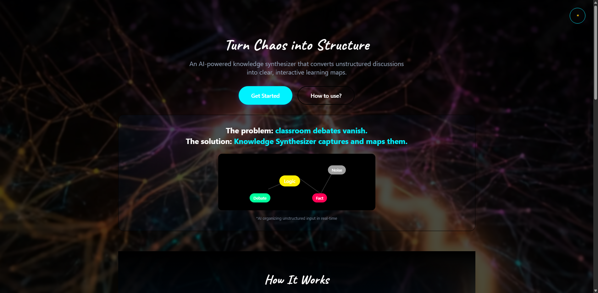

# 🧠 Knowledge Synthesizer: AI-Powered Learning Pipeline




An intelligent audio-to-knowledge system that transforms passive listening into active, retained expertise.

## 🚀 The Core Problem & AI Solution


## 👥 Who This Is For
- **EdTech Startups**: Organizations building the next generation of AI-driven adaptive learning tools.
- **Corporate Training Platforms**: Implementing internal Knowledge Management Systems (LMS) with automated summarization.
- **Content Creators & Educators**: Seeking to turn raw video/audio content into structured study materials (Flashcards, Quizzes) instantly.

## ✨ Technical Features
- **Smart Transcription**: Seamlessly converts speech to text using `SpeechRecognition` and `pydub`.
- **NLP Insights**: Automatically extracts key arguments and builds **Concept Maps** via TextBlob.
- **Active Recall Engine**: Generates automated study aids to bridge the gap between "Information" and "Retention".
- **High-Performance API**: Built with FastAPI for rapid, asynchronous processing.

## 🏗️ Code Architecture

```
Knowledge-Synthesizer/
├── backend/
│   ├── main.py              # FastAPI app entry point & API endpoints
│   ├── requirements.txt     # Pinned Python dependencies
│   ├── .env.example         # Environment variable template
│   ├── Dockerfile           # Container definition
│   └── src/
│       ├── tagging.py       # SmartTagger: NLP-based hashtag generator
│       ├── retention_engine.py # Flashcards, quizzes, spaced repetition
│       ├── visual_notes.py  # Whiteboard snapshot manager
│       ├── chaptering.py    # Audio chapter segmentation
│       ├── diarization.py   # Speaker diarization
│       └── review_engine.py # Scheduled review system
├── frontend/
│   └── index.html           # Single-page UI
└── .github/
    └── workflows/
        └── python-tests.yml # CI/CD - runs on every push
```

## 🛠️ Backend Architecture & NLP Features
The "Knowledge Synthesizer" isn't just a UI—it's a sophisticated data pipeline capable of handling high-concurrency requests.
- **Asynchronous Processing**: Leverages FastAPI's `async` capabilities to handle audio stream processing and NLP heavy-lifting without blocking the main event loop.
- **NLP Sentiment & Polarity Analysis**: Uses TextBlob to determine the tonality of transcribed content, which aids in classifying the nature of the "knowledge" (e.g., factual vs. opinionated).
- **Automated Summarization Logic**: The backend logic parses raw transcripts to extract noun phrases and key concepts, which are then used to auto-populate study aids.
- **Extensible Audio Pipeline**: The modular design allows for easy integration with OpenAI's Whisper or Google's Speech-to-Text for enterprise-grade deployments.

## 🛠️ Tech Stack
- **Backend**: Python 3.10+, [FastAPI](https://fastapi.tiangolo.com/)
- **Audio Processing**: `speech_recognition==3.10.0`, `pydub==0.25.1` (FFmpeg backend)
- **NLP Processing**: `textblob==0.17.1`
- **Testing**: `pytest`, `httpx`

## 🚀 Local Development Setup

```bash
git clone https://github.com/amanamarjit243222/Knowledge-Synthesizer.git
cd Knowledge-Synthesizer

# 1. Configure environment
cp backend/.env.example backend/.env
# Edit .env with your settings (see .env.example for reference)

# 2. Install dependencies
pip install -r backend/requirements.txt

# 3. Run the API server
cd backend
uvicorn main:app --reload --host 0.0.0.0 --port 8000
```
*Open `frontend/index.html` in your browser to start synthesizing.*

## 🐳 Docker Deployment

```bash
# Build the container
docker build -t knowledge-synthesizer ./backend

# Run in production mode
docker run -p 8000:8000 --env-file backend/.env knowledge-synthesizer
```

## 🧪 Running Tests

```bash
# Install test dependencies
pip install pytest httpx

# Run all unit + integration tests
python -m pytest backend/tests/ -v
```

Test coverage includes:
- `test_tagging.py` — SmartTagger tag generation logic
- `test_retention_engine.py` — Flashcard, quiz, and spaced repetition logic
- `test_api.py` — API endpoint integration tests

## 🔒 Security & Environment Variables

All secrets are managed via environment variables. **Never commit `.env` to version control.**

| Variable | Description | Default |
|---|---|---|
| `HOST` | Server bind address | `0.0.0.0` |
| `PORT` | Server port | `8000` |
| `ALLOWED_ORIGINS` | CORS allowed origins (restrict in prod) | `*` |
| `FFMPEG_PATH` | Path to FFmpeg binary (Windows) | auto-detect |

See [`backend/.env.example`](backend/.env.example) for the full template.

## 📸 Application Interface

